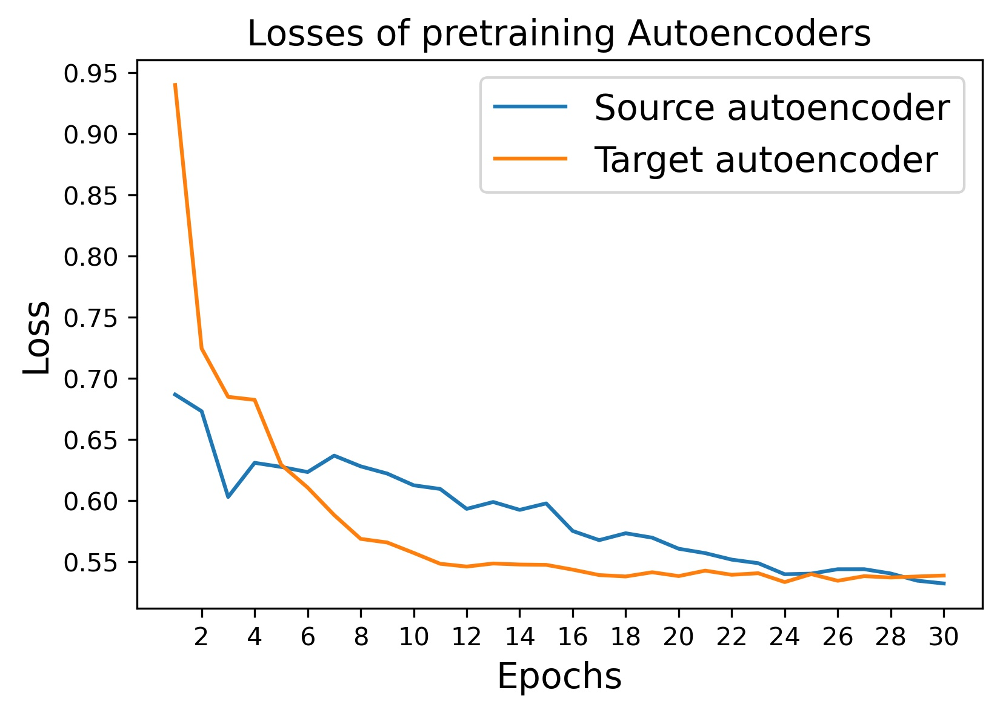
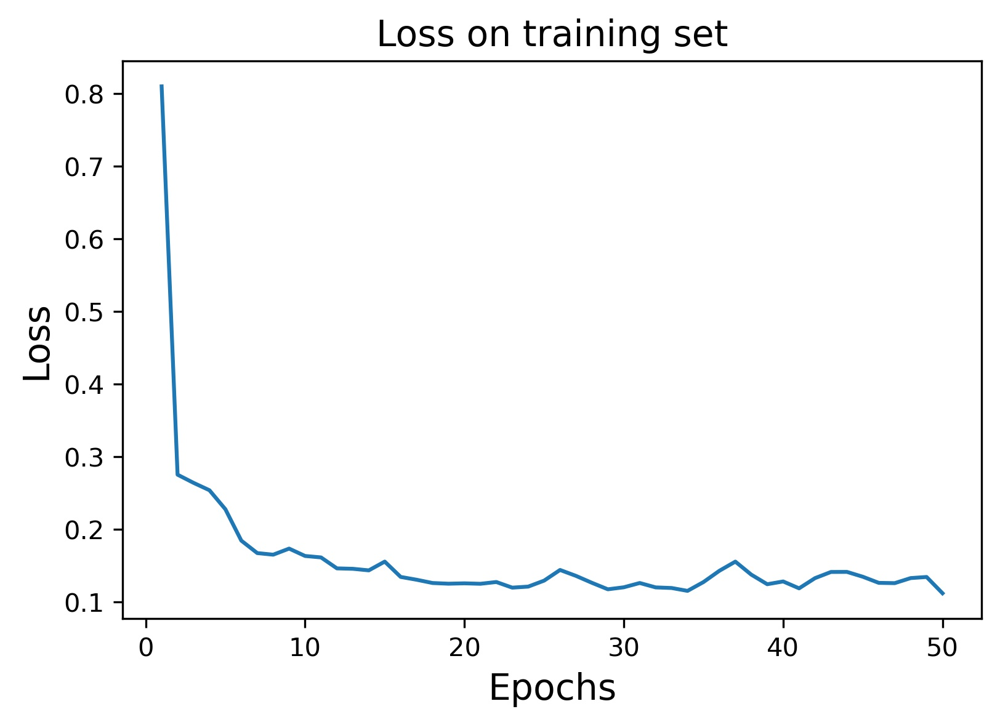
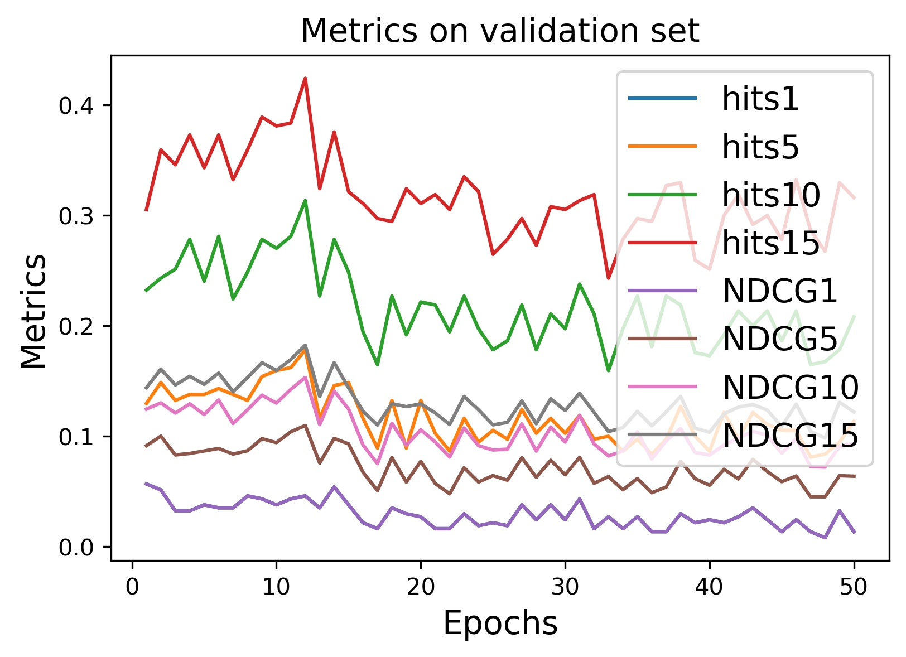

# DSC291Project

## Dataset Generation
The data generation process is implemented in `dataset_generator_ml_nf.ipynb`, please refer to the README.md file in the main branch.

## Running Instruction

Our model and training processed is implemented with PyTorch along with other common Python libraries like numpy and pandas. 
Also, to reproduce this experiment, please have a working GPU and CUDA & CUDNN on your computer.

### Step 1: Uncompress dataset
Unzip `dataset.zip` to get the datasets.

### Step 2: Create folders to store results
In the root directory, create folders `pretrain`, `weights`, or alternatively, run

```bash
mkdir pretrain
mkdir weights
```

Along with the existing folders, there should be 5 folders in total, namely `dataset`, `images`, `log`, `pretrain`, `weights`.
These folders will be used to store the logs or results during the training, validation and testing process.

### Step 3: Pretrain auto-encoders

Run Train_AutoRec.py twice with the argument `train_S` in the `argparse` being `True` and `False`, alternatively, run

```bash
python Train_AutoRec.py --train_S True
python Train_AutoRec.py --train_S False
```

This step will pretrain the autoencoders on the source and target domain respectively. If everything goes well, there will be
`S_AutoRec.pkl` and `T_AutoRec.pkl` in the `pretrain` folder.

You could check `Train_AutoRec.py` and add other arguments in the command line as you wish.

Note: This step won't take too long, training of both autoencoders took about 2 minutes on my laptop.

### Step 4: Train the model

Run Train_DArec.py to train the model, alternatively, run

```bash
python Train_DArec.py
```

Similarly, you could change hyperparameters by adding more arguments in the command line. Please check this python file for more details of the arguments.

Note: The training and validation in each epoch won't take too long. Each epoch will take about 10 seconds with GPU on my laptop.
The sampling process during testing will take about 2 minutes.

### Step 5: Visualization

If the training goes well, there should be a `best_model.pkl` in the `weights` folder, and 11 npy files and 1 json file in `log` folder.
You could start up the Jupyter notebook `visualization.ipynb` to run the visualization code snippets.

## Experiment results

### Loss of AutoEncoder

<div style="text-align: center;">

</div>

### Loss of training DARec

<div style="text-align: center;">

</div>

### Performance on validation set
<div style="text-align: center;">

</div>

### Performance on testing set
<div style="text-align: center;">

</div>

The performance on the testing set (recorded in `log\test_result.json`):
```python
{
    "test_hits1": 0.02430763100219167, 
    "test_hits5": 0.10978282526399681, 
    "test_hits10": 0.2084080494122335, 
    "test_hits15": 0.3124128312412831, 
    "test_ndcg1": 0.02430763100219167, 
    "test_ndcg5": 0.06637512037934581, 
    "test_ndcg10": 0.09763475055912904, 
    "test_ndcg15": 0.1250450295488673
}
```
